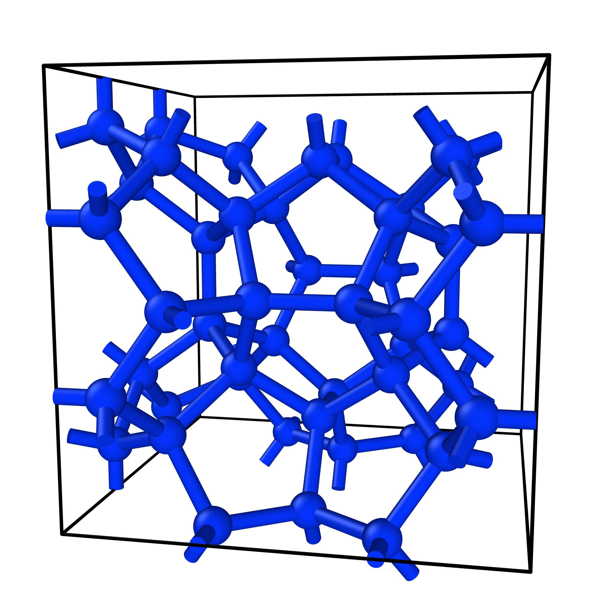

Topology data
=============

Assigning topology data (i.e. how atoms are connected) to a structure might be
required, for example to run simple molecular dynamics simulations. This can be
applied even when structural coarse-graining isn't required, such as for 
zeolites.

Let's load the zeolite **MEP** net, find neighbours using a cut-off, and save the
file in LAMMPS data format.

    >>> from chic import Structure
    >>> mep = Structure.from_cif("MEP.cif")
    >>> mep.get_neighbours_by_cutoff(rcut=1.8) # Ā
    >>> mep.find_atomic_clusters()
    >>> mep.get_coarse_grained_net()
    >>> mep.net_to_lammps_data("MEP.data", write_bonds=True, write_angles=True)

.. image:: ../_static/mep.png
    :align: center
    :width: 400px
    :target: .

The bonds and angles will automatically be *clustered* into unique types. Here
is the header of the file we wrote

.. include:: ../_static/mep.data
   :literal:

What if we only wanted the Si nodes of the network? One easy way would be to 
simply delete the bridging oxygen atoms, and connect up Si nodes. We can do this
with a careful chosen neighbour list.

    >>> mep.remove_sites_by_symbol("O") # remove bridging oxygens
    >>> mep.get_neighbours_by_cutoff(by_element_pair={("Si", "Si"): (2.5, 3.5)})
    >>> mep.find_atomic_clusters(max_intra_bond_length=0.5, max_inter_bond_length=3.5)
    >>> mep.get_coarse_grained_net()
    >>> mep.net_to_lammps_data("MEP-nodes.data", write_bonds=True, write_angles=True)

Similarly, the bonds and angles will be assigned to unique types.

.. include:: ../_static/mep-nodes.data
   :literal: